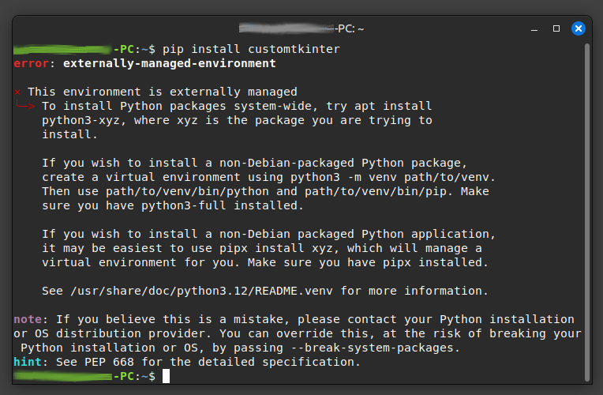

# Python Virtual Environment Setup Script

## Overview
This Bash script automates the setup of a Python virtual environment on a Linux system. It ensures that Python 3 is installed, creates a virtual environment, and configures a convenient `gwnpy` command to activate it.

## Features
- Checks for Python 3 and installs it if necessary
- Creates a virtual environment in `~/python_env`
- Ensures proper ownership of the virtual environment directory
- Adds a `gwnpy` command to `.bashrc` for easy activation
- Applies changes immediately so the function is available right away

## Prerequisites
- A Linux system with Bash shell
- `sudo` privileges

## Installation
### Clone the Repository

```bash
git clone https://github.com/svensgwen/gwnpy.git
```
Change Directory (Open the project directory)
```bash
cd gwnpy
```

### Run the Script
Change privileges for user
```bash
chmod +x gwnpy-installer.sh
```
Install
```bash
./gwnpy-installer.sh
```

## Usage
After running the script, you can activate the virtual environment using the custom `gwnpy` command:

```bash
gwnpy
```

To deactivate the virtual environment, simply run:
```bash
deactivate
```

## How It Works
1. **Password Prompt**: The script asks for your password upfront to perform installations if needed.
2. **Python Check**: It verifies if Python 3 is installed; if not, it installs it.
3. **Virtual Environment Creation**: If `~/python_env` does not exist, it creates a Python virtual environment there.
4. **Ownership Fix**: Ensures the user has ownership of the `~/python_env` directory.
5. **Command Setup**: Appends a function `gwnpy` to `~/.bashrc`, making it easy to activate the virtual environment.
6. **Immediate Application**: The script sources `~/.bashrc` so that changes take effect immediately.

## Troubleshooting
### Pip Installation Error
If you encounter an error while installing `pip`, here is an example of the error message and how it was resolved:

#### Before Fixing the Error


#### After Fixing the Error


To fix common `pip` installation errors, try running the following command after setting up the virtual environment:
```bash
python3 -m ensurepip --default-pip
```
If the issue persists, you may need to reinstall Python and `pip` manually.

## Notes
- The script assumes you are using Bash (`~/.bashrc`). If you use a different shell (like Zsh), you may need to manually add the function to `~/.zshrc`.
- If you want to change the virtual environment directory, modify the `VENV_DIR` variable in the script.

## License
This project is licensed under the MIT License. Feel free to modify and share it.

## Contributing
Pull requests are welcome! If you find issues, open an issue on GitHub.

---

*Created by SvensGwen*

